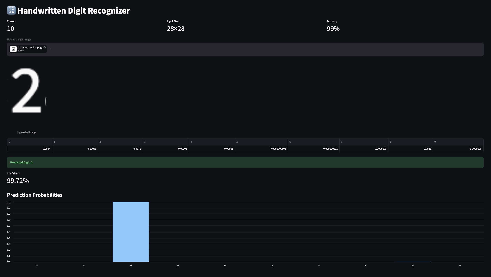

# 🔢 Handwritten Digit Recognizer

A deep learning web application that recognizes handwritten digits (0–9) using a Convolutional Neural Network (CNN) trained on the MNIST dataset.

Built using TensorFlow, Keras, and Streamlit.

---

## 🚀 Features

- Upload handwritten digit images
- Predict digits from 0–9
- Displays prediction confidence
- Shows probability distribution for all digits
- CNN model trained on the MNIST dataset
- Interactive web interface using Streamlit

---

## 📸 Application Screenshots

<p align="center">
  
</p>


## 🛠 Tech Stack

- Python
- TensorFlow
- Keras
- NumPy
- Pandas
- Pillow
- Streamlit
- Matplotlib

---

## 📂 Project Structure

```
handwritten-digit-recognizer/
│
├── app/
│   ├── app.py
│   └── test_streamlit_tf.py
│
├── models/
│   └── digit_model.keras
│
├── notebooks/
│   └── MNIST_EDA.ipynb
│
├── src/
│   ├── train_model.py
│   ├── predict.py
│   └── test_tensorflow.py
│
├── requirements.txt
└── README.md
```

---

## 🧠 Model Architecture

- Conv2D (32 filters)
- MaxPooling2D
- Conv2D (64 filters)
- MaxPooling2D
- Flatten
- Dense (128 neurons)
- Dense (10 outputs, Softmax)

---

## 📊 Dataset

The model is trained on the MNIST handwritten digit dataset.

- 60,000 training images
- 10,000 testing images
- Image size: 28 × 28 pixels

---

## 📈 Model Performance

- Test Accuracy: **99%**

---

## ▶️ Installation

Clone the repository

```bash
git clone https://github.com/aarushi481/handwritten-digit-recognizer.git
```

Move inside the project

```bash
cd handwritten-digit-recognizer
```

Install dependencies

```bash
pip install -r requirements.txt
```

Run the Streamlit app

```bash
streamlit run app/app.py
```

---

## 🎯 Future Improvements

- Draw digits directly on a canvas
- Deploy on Streamlit Cloud
- Support multiple digit recognition
- Mobile-friendly interface

---

## 👩‍💻 Author

**Aarushi Goyal**
